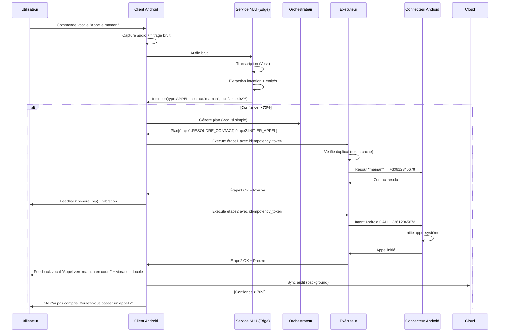
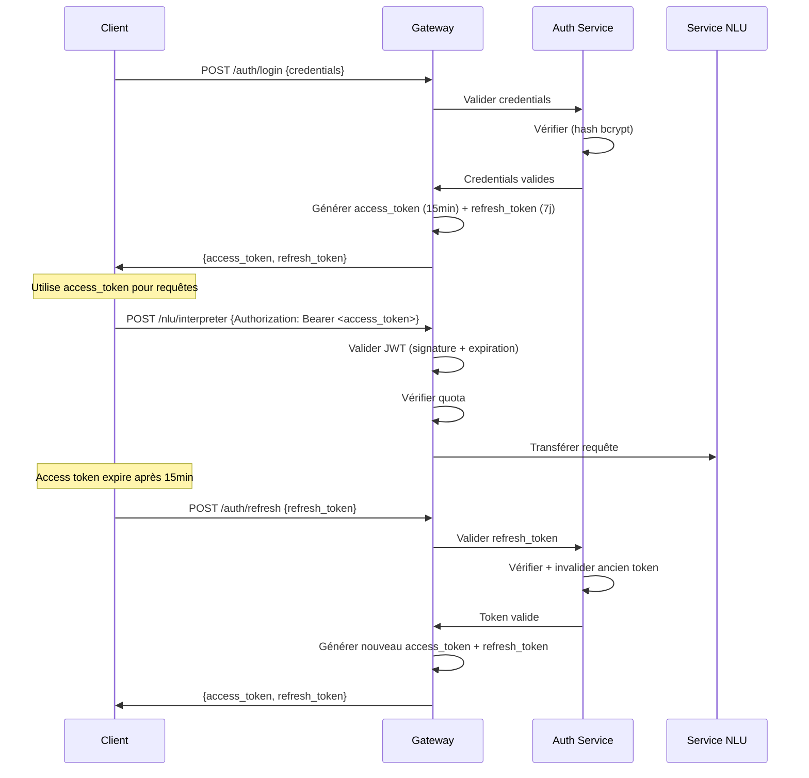

# Document de Conception - Assistant Vocal Accessible

## Vue d'Ensemble

### Contexte

L'assistant vocal accessible est un système backend innovant permettant à des personnes analphabètes et/ou malvoyantes d'interagir en temps réel avec leur appareil Android via des commandes vocales. Le système transforme des intentions vocales ou visuelles en actions fiables, sécurisées et vérifiables.

### Principes Directeurs

**1. Edge-First (Priorité au Local)**

L'architecture privilégie l'exécution locale pour minimiser la latence et permettre un fonctionnement hors ligne robuste. Le cloud n'intervient que pour les orchestrations complexes ou les fonctionnalités nécessitant des ressources importantes.

*Fondement technique :* Les architectures offline-first traitent la base de données locale comme source de vérité, le réseau devenant un mécanisme de synchronisation en arrière-plan ([developer.android.com](https://developer.android.com/topic/architecture/data-layer/offline-first)). Cette approche élimine les états de chargement dépendants de la connectivité et améliore considérablement l'expérience utilisateur.

**2. Modularité et Faible Couplage**

Chaque composant expose des interfaces clairement définies et peut fonctionner de manière autonome. Les dépendances sont explicites et minimales.

**3. Fiabilité et Idempotence**

Toutes les actions sensibles sont conçues pour être idempotentes : exécuter plusieurs fois la même opération produit le même résultat qu'une seule exécution. Cette propriété est essentielle pour gérer les retries et les défaillances réseau ([docs.aws.amazon.com](https://docs.aws.amazon.com/wellarchitected/latest/framework/rel_prevent_interaction_failure_idempotent.html)).

**4. Accessibilité Multimodale**

Le système combine retours vocaux, sonores et haptiques pour créer une expérience riche et accessible sans dépendre de l'affichage visuel.

### Objectifs de Performance

- **Latence NLU** : < 500ms (P95)
- **Génération de plan** : < 300ms (P95)
- **Throughput** : 1000 requêtes concurrentes/seconde
- **Disponibilité** : 99.9% (incluant mode hors ligne)
- **Taux de succès intentions** : > 95%

---

## Architecture

### Vision Stratégique

L'architecture suit un modèle en trois couches avec une forte séparation des responsabilités :

```
┌─────────────────────────────────────────────────────────┐
│              CLIENT ANDROID (Edge Layer)                │
│  ┌──────────────┐  ┌──────────────┐  ┌──────────────┐ │
│  │  Interface   │  │   Modèles    │  │  Stockage    │ │
│  │  Vocale +    │  │   NLU        │  │  Local       │ │
│  │  Haptique    │  │  Embarqués   │  │  Chiffré     │ │
│  └──────────────┘  └──────────────┘  └──────────────┘ │
│  ┌────────────────────────────────────────────────────┐│
│  │         Connecteur Android (AccessibilityService)   ││
│  └────────────────────────────────────────────────────┘│
└─────────────────────────────────────────────────────────┘
                          ↕ (Sync opportuniste)
┌─────────────────────────────────────────────────────────┐
│               BACKEND SERVICES (Cloud Layer)            │
│  ┌──────────────────────────────────────────────────┐  │
│  │            Gateway API (Auth + Routage)          │  │
│  └──────────────────────────────────────────────────┘  │
│           ↓                ↓                ↓           │
│  ┌──────────────┐  ┌──────────────┐  ┌──────────────┐ │
│  │  Service NLU │  │ Orchestrateur│  │  Exécuteur   │ │
│  │   (Cloud)    │  │   Tâches     │  │  Sécurisé    │ │
│  └──────────────┘  └──────────────┘  └──────────────┘ │
│           ↓                ↓                ↓           │
│  ┌──────────────────────────────────────────────────┐  │
│  │         Store Mémoire + Journal Audit            │  │
│  └──────────────────────────────────────────────────┘  │
└─────────────────────────────────────────────────────────┘
```

### Stratégie Edge-First : Quand Exécuter Localement vs Cloud

| Capacité | Exécution | Justification |
|----------|-----------|---------------|
| **NLU pour intentions prioritaires** | Edge (Vosk/Whisper embarqué) | Latence critique < 500ms, fonctionne hors ligne |
| **NLU pour intentions complexes** | Cloud (avec fallback) | Modèles plus larges, langues/dialectes rares |
| **Génération plan simple** | Edge (règles locales) | Actions directes (appel, SMS, alarme) |
| **Génération plan multi-étapes** | Cloud | Nécessite contexte large et orchestration complexe |
| **Exécution actions natives** | Edge (AccessibilityService) | Interaction directe avec OS Android |
| **Synchronisation et audit** | Cloud (après succès local) | Garantit traçabilité et backup |

*Fondement :* Les modèles de reconnaissance vocale comme Vosk supportent 20+ langues avec une exécution offline efficace ([github.com/alphacep/vosk-api](https://github.com/alphacep/vosk-api)), tandis que Whisper.cpp permet l'exécution de modèles de transcription sur mobile ([ionio.ai](https://www.ionio.ai/blog/running-transcription-models-on-the-edge-a-practical-guide-for-devices)).

### Flux de Données Principal

**Scénario : "Appelle maman"**



### Gestion du Mode Hors Ligne

**Stratégie de synchronisation :**

1. **Détection de connectivité** : Le client Android surveille l'état réseau (ConnectivityManager)
2. **File d'attente persistante** : Les actions non-locales sont sérialisées dans une file chiffrée (AES-256) via SQLCipher
3. **Synchronisation opportuniste** : Dès reconnexion, WorkManager déclenche la sync avec retry exponentiel
4. **Résolution de conflits** : Les timestamps et idempotency tokens permettent de déduplicater côté serveur

*Fondement :* L'architecture offline-first utilise Room DB comme source de vérité unique (SSOT) avec synchronisation asynchrone via WorkManager ([medium.com](https://medium.com/@enesselcuk/local-first-offline-first-architecture-on-android-synchronization-and-reactive-state-management-314129d136dd)).

---

## Composants et Interfaces

### 1. Client Android

**Responsabilités :**
- Capture et prétraitement audio (filtrage adaptatif du bruit)
- Gestion de l'interface utilisateur multimodale (vocal, sonore, haptique)
- Exécution du NLU local (modèles embarqués)
- Orchestration locale pour actions simples
- Gestion du stockage local chiffré
- Synchronisation opportuniste avec le backend

**Technologies :**
- **Speech-to-Text** : Vosk (modèles légers 50-100MB) pour intentions prioritaires
- **Fallback** : Whisper.cpp pour langues/dialectes moins courants
- **Stockage** : SQLCipher (SQLite chiffré AES-256)
- **Text-to-Speech** : Android TTS avec configuration vocale personnalisable
- **Accessibilité** : AccessibilityService pour interaction UI programmatique

**Interface exposée :**

```kotlin
interface GestionnaireVocal {
    // Capture et traitement
    suspend fun capturerAudio(): Flow<AudioBuffer>
    suspend fun interpreterIntention(audio: AudioBuffer): ResultatNLU
    
    // Feedback multimodal
    suspend fun fournirRetourVocal(message: String, vitesse: Float = 1.0f)
    suspend fun emettreSonSysteme(type: TypeSon)
    suspend fun emettrVibration(pattern: PatternVibration)
    
    // Configuration
    suspend fun configurerPreferences(config: ConfigurationVocale)
}

data class ResultatNLU(
    val typeIntention: TypeIntention,
    val entites: Map<String, Any>,
    val niveauConfiance: Float,
    val langueDetectee: Langue
)

enum class TypeSon {
    DEMARRAGE_ACTION,    // Bip court
    SUCCES,              // Tonalité montante
    ERREUR,              // Tonalité descendante
    CONFIRMATION_REQUISE // Bip double
}

data class PatternVibration(
    val durees: List<Long>,  // Alternance vibration/pause en ms
    val intensite: Int       // 0-255
)
```

### 2. Service NLU (Edge + Cloud)

**Responsabilités :**
- Transcription audio en texte (ASR - Automatic Speech Recognition)
- Détection automatique de la langue
- Extraction d'intentions et d'entités (NLU - Natural Language Understanding)
- Gestion du cache pour intentions fréquentes
- Fallback cloud pour intentions complexes

**Architecture hybride :**

```
┌─────────────────────────────────────────┐
│        Service NLU (Edge)               │
│  ┌──────────────┐    ┌──────────────┐  │
│  │   Vosk ASR   │    │ NLU Rules    │  │
│  │  (20 langues)│ -> │  (Patterns)  │  │
│  └──────────────┘    └──────────────┘  │
│         ↓ (si confiance < 70%)         │
└─────────────────────────────────────────┘
         ↓ Fallback
┌─────────────────────────────────────────┐
│        Service NLU (Cloud)              │
│  ┌──────────────┐    ┌──────────────┐  │
│  │ Whisper API  │    │  LLM (GPT-4) │  │
│  │  (multilingue│ -> │  + Few-shot  │  │
│  └──────────────┘    └──────────────┘  │
└─────────────────────────────────────────┘
```

**Modèle NLU local (règles) :**

Pour les 20 intentions prioritaires, un système de règles basé sur des patterns suffit :

```
INTENTION : APPEL
Patterns : 
  - "appelle {contact}"
  - "passe un appel à {contact}"
  - "téléphone à {contact}"
Entités : contact (string)

INTENTION : SMS
Patterns :
  - "envoie un message à {contact} {message}"
  - "SMS à {contact} : {message}"
Entités : contact (string), message (string)

INTENTION : ALARME
Patterns :
  - "réveille-moi à {heure}"
  - "alarme {heure}"
Entités : heure (time)
```

**Interface exposée :**

```kotlin
interface ServiceNLU {
    suspend fun interpreter(
        audio: AudioBuffer,
        contexte: ContexteUtilisateur? = null
    ): ResultatInterpretation
    
    suspend fun detecterLangue(audio: AudioBuffer): Langue
    
    suspend fun validerConfiance(
        resultat: ResultatInterpretation
    ): Boolean
}

data class ResultatInterpretation(
    val intention: Intention,
    val confiance: Float,
    val langue: Langue,
    val entitesExtraites: Map<String, EntiteNLU>,
    val sourceTraitement: SourceNLU // EDGE ou CLOUD
)

data class Intention(
    val type: TypeIntention,
    val parametres: Map<String, Any>
)

sealed class EntiteNLU {
    data class Contact(val nom: String, val numero: String?) : EntiteNLU()
    data class Temporel(val instant: Instant) : EntiteNLU()
    data class Texte(val contenu: String) : EntiteNLU()
    data class Montant(val valeur: BigDecimal, val devise: String) : EntiteNLU()
}

enum class SourceNLU { EDGE, CLOUD }
```

### 3. Orchestrateur de Tâches

**Responsabilités :**
- Génération de plans d'actions à partir d'intentions
- Vérification des préconditions
- Définition des stratégies de compensation (rollback)
- Gestion de l'état d'exécution des plans
- Détection des actions sensibles nécessitant confirmation

**Logique de planification :**

```kotlin
class OrchestrateurdeTaches {
    suspend fun genererPlan(intention: Intention): PlanAction {
        // 1. Analyser l'intention
        val etapes = when (intention.type) {
            TypeIntention.APPEL -> {
                listOf(
                    Etape(
                        id = UUID.randomUUID(),
                        action = ActionType.RESOUDRE_CONTACT,
                        parametres = mapOf("contact" to intention.parametres["contact"]),
                        preconditions = listOf(Precondition.PERMISSION_CONTACTS),
                        estimation = Duration.ofMillis(50)
                    ),
                    Etape(
                        id = UUID.randomUUID(),
                        action = ActionType.INITIER_APPEL,
                        parametres = mapOf("numero" to "{{etape_precedente.numero}}"),
                        preconditions = listOf(Precondition.PERMISSION_PHONE),
                        estimation = Duration.ofMillis(100)
                    )
                )
            }
            TypeIntention.SMS -> {
                listOf(
                    Etape(
                        action = ActionType.RESOUDRE_CONTACT,
                        // ...
                    ),
                    Etape(
                        action = ActionType.ENVOYER_SMS,
                        sensible = false,
                        // ...
                    )
                )
            }
            TypeIntention.PAIEMENT -> {
                listOf(
                    Etape(
                        action = ActionType.VALIDER_MONTANT,
                        sensible = true,
                        niveauConfirmation = NiveauConfirmation.CRITIQUE,
                        // ...
                    ),
                    Etape(
                        action = ActionType.EXECUTER_PAIEMENT,
                        sensible = true,
                        strategieCompensation = CompensationStrategy.REMBOURSEMENT,
                        // ...
                    )
                )
            }
            // ... autres intentions
        }
        
        // 2. Vérifier les préconditions
        val preconditionsNonSatisfaites = verifierPreconditions(etapes)
        
        // 3. Marquer les actions sensibles
        val etapesAvecSecurite = etapes.map { etape ->
            if (detecterSensibilite(etape)) {
                etape.copy(
                    necessiteConfirmation = true,
                    niveauConfirmation = determinerNiveauConfirmation(etape)
                )
            } else etape
        }
        
        return PlanAction(
            id = UUID.randomUUID(),
            intention = intention,
            etapes = etapesAvecSecurite,
            preconditionsManquantes = preconditionsNonSatisfaites,
            estimationDuree = etapesAvecSecurite.sumOf { it.estimation.toMillis() }
        )
    }
}
```

**Interface exposée :**

```kotlin
interface OrchestrateurdeTaches {
    suspend fun genererPlan(intention: Intention): PlanAction
    suspend fun obtenirEtatProgression(planId: UUID): EtatProgression
    suspend fun proposerAlternatives(
        intention: Intention,
        preconditionsManquantes: List<Precondition>
    ): List<PlanAction>
}

data class PlanAction(
    val id: UUID,
    val intention: Intention,
    val etapes: List<Etape>,
    val preconditionsManquantes: List<Precondition>,
    val estimationDuree: Long, // en ms
    val timestamp: Instant = Instant.now()
)

data class Etape(
    val id: UUID = UUID.randomUUID(),
    val action: ActionType,
    val parametres: Map<String, Any>,
    val preconditions: List<Precondition>,
    val strategieCompensation: CompensationStrategy? = null,
    val sensible: Boolean = false,
    val necessiteConfirmation: Boolean = false,
    val niveauConfirmation: NiveauConfirmation = NiveauConfirmation.AUCUN,
    val estimation: Duration,
    val etat: EtatEtape = EtatEtape.EN_ATTENTE
)

enum class NiveauConfirmation {
    AUCUN,           // Exécution automatique
    VOCAL,           // Confirmation vocale simple
    CRITIQUE         // Vocal + PIN/biométrie
}

enum class EtatEtape {
    EN_ATTENTE,
    EN_COURS,
    SUCCES,
    ECHEC,
    ANNULE,
    ATTEND_CONFIRMATION
}

data class EtatProgression(
    val planId: UUID,
    val etapeCourante: Int,
    val totalEtapes: Int,
    val pourcentage: Float,
    val tempsEcoule: Duration,
    val tempsEstimeRestant: Duration
)
```

### 4. Exécuteur Sécurisé

**Responsabilités :**
- Exécution idempotente des actions
- Gestion des tentatives de retry avec backoff exponentiel
- Génération de preuves d'exécution cryptographiques
- Gestion du cache de tokens d'idempotence
- Support de l'annulation d'actions en cours

**Mécanisme d'idempotence :**

L'idempotence est garantie par un système de tokens d'idempotence inspiré des meilleures pratiques distribuées :

1. **Génération du token** : Le client génère un UUID v4 pour chaque demande d'action
2. **Stockage du résultat** : Le serveur stocke le résultat avec le token pendant 24h
3. **Détection de duplicat** : Si le même token arrive, le résultat stocké est retourné immédiatement

*Fondement :* Les systèmes idempotents utilisent des tokens générés côté client pour éviter les duplications lors de retries ([dev.to](https://dev.to/gabrielanhaia/the-idempotency-token-pattern-every-event-driven-system-forgets-until-3-am-2fk2)). Stripe et AWS API Gateway utilisent ce pattern (header `Idempotency-Key`).

```kotlin
class ExecuteurSecurise(
    private val cacheIdempotence: CacheIdempotence,
    private val journalAudit: JournalAudit
) {
    suspend fun executer(
        etape: Etape,
        tokenIdempotence: UUID
    ): ResultatExecution {
        // 1. Vérifier si déjà exécuté
        cacheIdempotence.obtenir(tokenIdempotence)?.let { resultatCache ->
            return resultatCache.copy(
                source = SourceResultat.CACHE_IDEMPOTENCE
            )
        }
        
        // 2. Exécuter avec retry
        val resultat = executerAvecRetry(etape)
        
        // 3. Générer preuve d'exécution
        val preuve = genererPreuve(etape, resultat)
        
        // 4. Stocker dans cache (24h TTL)
        cacheIdempotence.stocker(tokenIdempotence, resultat, Duration.ofHours(24))
        
        // 5. Audit
        journalAudit.enregistrer(
            EntreeAudit(
                timestamp = Instant.now(),
                action = etape.action,
                tokenIdempotence = tokenIdempotence,
                resultat = resultat,
                preuve = preuve
            )
        )
        
        return resultat.copy(preuve = preuve)
    }
    
    private suspend fun executerAvecRetry(
        etape: Etape,
        maxTentatives: Int = 3
    ): ResultatExecution {
        var derniereException: Exception? = null
        
        for (tentative in 1..maxTentatives) {
            try {
                return executerActionDirecte(etape)
            } catch (e: Exception) {
                derniereException = e
                if (tentative < maxTentatives) {
                    val delai = (2.0.pow(tentative - 1) * 1000).toLong() // 1s, 2s, 4s
                    delay(delai)
                }
            }
        }
        
        throw ExecutionException(
            "Échec après $maxTentatives tentatives",
            derniereException
        )
    }
    
    private fun genererPreuve(etape: Etape, resultat: ResultatExecution): PreuveExecution {
        val donnees = "${etape.id}|${resultat.timestamp}|${resultat.statut}"
        val signature = signerDonnees(donnees)
        
        return PreuveExecution(
            idAction = etape.id,
            timestamp = resultat.timestamp,
            statut = resultat.statut,
            signature = signature,
            algorithme = "SHA-256-RSA"
        )
    }
}
```

**Interface exposée :**

```kotlin
interface ExecuteurSecurise {
    suspend fun executer(
        etape: Etape,
        tokenIdempotence: UUID
    ): ResultatExecution
    
    suspend fun annuler(
        executionId: UUID
    ): ResultatAnnulation
    
    suspend fun verifierPreuve(
        preuve: PreuveExecution
    ): Boolean
}

data class ResultatExecution(
    val idExecution: UUID,
    val statut: StatutExecution,
    val resultat: Any?,
    val timestamp: Instant,
    val duree: Duration,
    val preuve: PreuveExecution?,
    val source: SourceResultat = SourceResultat.EXECUTION_DIRECTE
)

enum class StatutExecution {
    SUCCES,
    ECHEC,
    ANNULE,
    ATTEND_CONFIRMATION
}

enum class SourceResultat {
    EXECUTION_DIRECTE,
    CACHE_IDEMPOTENCE
}

data class PreuveExecution(
    val idAction: UUID,
    val timestamp: Instant,
    val statut: StatutExecution,
    val signature: ByteArray,
    val algorithme: String
)
```

### 5. Connecteur Android

**Responsabilités :**
- Interaction avec les APIs natives Android
- Gestion des permissions avec explications vocales
- Implémentation AccessibilityService pour automation UI
- Intégration avec applications tierces via Intents
- Capture photo et OCR pour lecture de texte

**Architecture AccessibilityService :**

L'AccessibilityService Android permet d'inspecter et d'interagir avec les interfaces utilisateur des applications ([developer.android.com](https://developer.android.com/guide/topics/ui/accessibility/services.html)). Cette capacité est essentielle pour exécuter des actions dans des applications tierces.

```kotlin
class ConnecteurAndroid : AccessibilityService() {
    
    // Interaction avec UI native
    suspend fun envoyerSMS(numero: String, message: String): ResultatAction {
        // Vérifier permission
        if (!verifierPermission(Manifest.permission.SEND_SMS)) {
            return ResultatAction.PermissionManquante(
                permission = "SMS",
                explicationVocale = "J'ai besoin de la permission d'envoyer des SMS pour compléter cette action"
            )
        }
        
        val smsManager = SmsManager.getDefault()
        smsManager.sendTextMessage(numero, null, message, null, null)
        
        return ResultatAction.Succes(
            message = "Message envoyé à $numero"
        )
    }
    
    // Interaction via AccessibilityService
    suspend fun interagirAvecApp(
        packageName: String,
        action: ActionUI
    ): ResultatAction {
        // Vérifier que l'app est installée
        if (!verifierApplicationInstallee(packageName)) {
            return ResultatAction.ApplicationAbsente(
                app = packageName,
                messageVocal = "L'application $packageName n'est pas installée"
            )
        }
        
        // Lancer l'app si nécessaire
        if (!verifierApplicationActive(packageName)) {
            lancerApplication(packageName)
            delay(2000) // Attendre le démarrage
        }
        
        // Trouver et cliquer sur l'élément
        return when (action) {
            is ActionUI.Cliquer -> {
                val node = trouverNodeParTexte(action.texte) 
                    ?: trouverNodeParId(action.resourceId)
                    ?: return ResultatAction.ElementNonTrouve(action.texte)
                
                node.performAction(AccessibilityNodeInfo.ACTION_CLICK)
                ResultatAction.Succes("Élément cliqué")
            }
            is ActionUI.SaisirTexte -> {
                val node = trouverChampTexte(action.champId)
                    ?: return ResultatAction.ElementNonTrouve(action.champId)
                
                val arguments = Bundle().apply {
                    putCharSequence(
                        AccessibilityNodeInfo.ACTION_ARGUMENT_SET_TEXT_CHARSEQUENCE,
                        action.texte
                    )
                }
                node.performAction(AccessibilityNodeInfo.ACTION_SET_TEXT, arguments)
                ResultatAction.Succes("Texte saisi")
            }
        }
    }
    
    // OCR pour lecture de texte
    suspend fun lireTexteEcran(): String {
        val screenshot = capturerEcran()
        return executerOCR(screenshot) // Utilise ML Kit Text Recognition
    }
}
```

**Interface exposée :**

```kotlin
interface ConnecteurAndroid {
    // Communications
    suspend fun passerAppel(numero: String): ResultatAction
    suspend fun envoyerSMS(numero: String, message: String): ResultatAction
    
    // Calendrier et alarmes
    suspend fun creerEvenement(evenement: Evenement): ResultatAction
    suspend fun creerAlarme(heure: LocalTime): ResultatAction
    
    // Système
    suspend fun modifierParametre(parametre: ParametreSysteme, valeur: Any): ResultatAction
    suspend fun obtenirEtatBatterie(): NiveauBatterie
    
    // Applications tierces
    suspend fun lancerApplication(packageName: String): ResultatAction
    suspend fun interagirAvecUI(packageName: String, action: ActionUI): ResultatAction
    
    // OCR et accessibilité
    suspend fun lireTexteEcran(): String
    suspend fun lireTexteImage(image: Bitmap): String
    
    // Permissions
    suspend fun verifierPermission(permission: String): Boolean
    suspend fun demanderPermission(
        permission: String,
        explicationVocale: String
    ): Boolean
}

sealed class ResultatAction {
    data class Succes(val message: String) : ResultatAction()
    data class Echec(val raison: String) : ResultatAction()
    data class PermissionManquante(
        val permission: String,
        val explicationVocale: String
    ) : ResultatAction()
    data class ApplicationAbsente(
        val app: String,
        val messageVocal: String
    ) : ResultatAction()
    data class ElementNonTrouve(val element: String) : ResultatAction()
}

sealed class ActionUI {
    data class Cliquer(val texte: String, val resourceId: String? = null) : ActionUI()
    data class SaisirTexte(val champId: String, val texte: String) : ActionUI()
    data class Defiler(val direction: Direction) : ActionUI()
}
```

### 6. Store Mémoire

**Responsabilités :**
- Stockage chiffré des données utilisateur (AES-256)
- Gestion des préférences vocales
- Historique des interactions
- Export et import de données
- Suppression sécurisée (overwrite + unlink)

**Schéma de chiffrement :**

```
Clé maîtresse (dérivée du PIN/biométrie)
    ↓ PBKDF2 (100k iterations)
Clé de chiffrement données (256 bits)
    ↓ AES-256-GCM
Données chiffrées + IV + Auth Tag
```

**Interface exposée :**

```kotlin
interface StoreMémoire {
    // Préférences
    suspend fun sauvegarderPreference(cle: String, valeur: Any)
    suspend fun obtenirPreference(cle: String): Any?
    suspend fun supprimerPreference(cle: String)
    
    // Historique
    suspend fun ajouterEntreeHistorique(entree: EntreeHistorique)
    suspend fun obtenirHistorique(
        filtre: FiltreHistorique,
        limite: Int = 100
    ): List<EntreeHistorique>
    
    // Contacts et contexte
    suspend fun sauvegarderContact(contact: Contact)
    suspend fun rechercherContact(nom: String): Contact?
    
    // Gestion des données
    suspend fun exporterDonnees(): ByteArray // Fichier chiffré
    suspend fun importerDonnees(donnees: ByteArray)
    suspend fun supprimerToutesDonnees() // Suppression sécurisée
    
    // Politique de rétention
    suspend fun configurerRetention(periode: PeriodeRetention)
    suspend fun appliquerRetention() // Supprime données expirées
}

data class EntreeHistorique(
    val id: UUID,
    val timestamp: Instant,
    val intention: Intention,
    val resultat: StatutExecution,
    val duree: Duration
)

data class Contact(
    val nom: String,
    val numeros: List<String>,
    val emails: List<String>?,
    val metadata: Map<String, String> = emptyMap()
)

enum class PeriodeRetention {
    SEPT_JOURS,
    TRENTE_JOURS,
    QUATRE_VINGT_DIX_JOURS,
    JAMAIS
}
```

### 7. Journal d'Audit

**Responsabilités :**
- Enregistrement immuable de toutes les actions
- Chaînage cryptographique des entrées (hash chain)
- Détection de tentatives de modification
- Interface de requêtage vocal de l'historique
- Génération de rapports d'audit

**Architecture du hash chain :**

Le journal d'audit implémente un chaînage cryptographique où chaque entrée inclut le hash de l'entrée précédente, rendant toute modification détectable ([dev.to](https://dev.to/veritaschain/building-tamper-evident-audit-trails-for-algorithmic-trading-a-developers-guide-4ie2)).

```
Entrée N-1: {données, timestamp, hash_precedent, signature}
    ↓ SHA-256
Hash N-1 = hash(entrée N-1)
    ↓
Entrée N: {données, timestamp, hash_precedent: Hash N-1, signature}
    ↓ SHA-256
Hash N = hash(entrée N)
```

**Implémentation :**

```kotlin
class JournalAudit(
    private val stockage: StockageAudit
) {
    private var dernierHash: ByteArray = ByteArray(32) // Hash genesis
    
    suspend fun enregistrer(entree: EntreeAudit): UUID {
        // 1. Créer l'entrée avec hash précédent
        val entreeComplete = entree.copy(
            hashPrecedent = dernierHash
        )
        
        // 2. Calculer le hash de cette entrée
        val hashEntree = calculerHash(entreeComplete)
        
        // 3. Signer l'entrée
        val signature = signerEntree(entreeComplete, hashEntree)
        
        // 4. Stocker
        val entreeFinale = entreeComplete.copy(
            hash = hashEntree,
            signature = signature
        )
        stockage.ajouter(entreeFinale)
        
        // 5. Mettre à jour le dernier hash
        dernierHash = hashEntree
        
        return entreeComplete.id
    }
    
    suspend fun verifierIntegrite(): ResultatVerification {
        val entrees = stockage.obtenirTout()
        var hashPrecedent = ByteArray(32) // Genesis
        
        for ((index, entree) in entrees.withIndex()) {
            // Vérifier que hash_precedent correspond
            if (!entree.hashPrecedent.contentEquals(hashPrecedent)) {
                return ResultatVerification.Compromis(
                    position = index,
                    raison = "Hash précédent invalide"
                )
            }
            
            // Recalculer le hash
            val hashCalcule = calculerHash(entree.copy(hash = ByteArray(32), signature = ByteArray(0)))
            if (!hashCalcule.contentEquals(entree.hash)) {
                return ResultatVerification.Compromis(
                    position = index,
                    raison = "Hash d'entrée invalide"
                )
            }
            
            // Vérifier la signature
            if (!verifierSignature(entree)) {
                return ResultatVerification.Compromis(
                    position = index,
                    raison = "Signature invalide"
                )
            }
            
            hashPrecedent = entree.hash
        }
        
        return ResultatVerification.Valide(totalEntrees = entrees.size)
    }
    
    private fun calculerHash(entree: EntreeAudit): ByteArray {
        val donnees = "${entree.id}|${entree.timestamp}|${entree.action}|" +
                      "${entree.resultat}|${entree.hashPrecedent.toHex()}"
        return MessageDigest.getInstance("SHA-256").digest(donnees.toByteArray())
    }
}
```

**Interface exposée :**

```kotlin
interface JournalAudit {
    suspend fun enregistrer(entree: EntreeAudit): UUID
    suspend fun obtenirHistorique(
        filtre: FiltreAudit,
        limite: Int = 100
    ): List<EntreeAudit>
    suspend fun verifierIntegrite(): ResultatVerification
    suspend fun genererRapport(periode: Period): RapportAudit
}

data class EntreeAudit(
    val id: UUID = UUID.randomUUID(),
    val timestamp: Instant,
    val action: ActionType,
    val parametres: Map<String, Any>,
    val resultat: StatutExecution,
    val duree: Duration,
    val tokenIdempotence: UUID,
    val preuve: PreuveExecution?,
    val hashPrecedent: ByteArray = ByteArray(32),
    val hash: ByteArray = ByteArray(32),
    val signature: ByteArray = ByteArray(0)
)

sealed class ResultatVerification {
    data class Valide(val totalEntrees: Int) : ResultatVerification()
    data class Compromis(val position: Int, val raison: String) : ResultatVerification()
}
```

### 8. Gateway API

**Responsabilités :**
- Authentification JWT avec refresh token rotation
- Routage vers les services appropriés
- Gestion des quotas par utilisateur
- Rate limiting et protection DDoS
- Logging des tentatives d'accès

**Flux d'authentification :**



*Fondement :* La rotation de refresh tokens améliore la sécurité en invalidant les tokens après usage, limitant la fenêtre d'exploitation en cas de compromission ([loginradius.com](https://www.loginradius.com/blog/identity/secure-refresh-token-rotation)).

**Gestion des quotas :**

```kotlin
class GestionnaireQuotas(
    private val cache: CacheDistribue
) {
    private val quotasParDefaut = QuotasUtilisateur(
        requetesNLU = 1000,
        actionsExecution = 500,
        actionsSensibles = 50
    )
    
    suspend fun verifierEtDecrementer(
        utilisateurId: UUID,
        typeQuota: TypeQuota
    ): ResultatQuota {
        val cle = "quota:${utilisateurId}:${typeQuota}:${LocalDate.now()}"
        
        val compteurActuel = cache.obtenir(cle)?.toInt() ?: 0
        val limite = when (typeQuota) {
            TypeQuota.NLU -> quotasParDefaut.requetesNLU
            TypeQuota.EXECUTION -> quotasParDefaut.actionsExecution
            TypeQuota.SENSIBLE -> quotasParDefaut.actionsSensibles
        }
        
        if (compteurActuel >= limite) {
            return ResultatQuota.Depasse(
                reste = 0,
                reinitialisation = LocalDate.now().plusDays(1).atStartOfDay()
            )
        }
        
        cache.incrementer(cle, ttl = Duration.ofDays(1))
        
        return ResultatQuota.Autorise(
            reste = limite - compteurActuel - 1
        )
    }
}
```

**Interface exposée :**

```kotlin
interface GatewayAPI {
    // Authentification
    suspend fun login(credentials: Credentials): TokensPair
    suspend fun refresh(refreshToken: String): TokensPair
    suspend fun logout(refreshToken: String)
    
    // Routage (interne)
    suspend fun router(requete: RequeteHTTP): ReponseHTTP
    
    // Quotas
    suspend fun obtenirQuotas(utilisateurId: UUID): QuotasUtilisateur
}

data class TokensPair(
    val accessToken: String,  // JWT 15min
    val refreshToken: String, // JWT 7 jours
    val expiration: Instant
)

data class QuotasUtilisateur(
    val requetesNLU: Int,
    val actionsExecution: Int,
    val actionsSensibles: Int,
    val resteNLU: Int? = null,
    val resteExecution: Int? = null,
    val resteSensibles: Int? = null
)
```

---

## Modèles de Données

### Schéma de Base de Données (Backend Cloud)

**Utilisateurs**

```sql
CREATE TABLE utilisateurs (
    id UUID PRIMARY KEY,
    email VARCHAR(255) UNIQUE NOT NULL,
    hash_mot_de_passe VARCHAR(255) NOT NULL, -- bcrypt
    langue_preferee VARCHAR(10) NOT NULL DEFAULT 'fr',
    date_creation TIMESTAMP NOT NULL DEFAULT NOW(),
    derniere_connexion TIMESTAMP,
    INDEX idx_email (email)
);
```

**Intentions (cache)**

```sql
CREATE TABLE cache_intentions (
    id UUID PRIMARY KEY,
    empreinte_audio VARCHAR(64) NOT NULL, -- SHA-256 de l'audio
    intention_type VARCHAR(50) NOT NULL,
    entites JSONB NOT NULL,
    confiance FLOAT NOT NULL,
    langue VARCHAR(10) NOT NULL,
    timestamp TIMESTAMP NOT NULL DEFAULT NOW(),
    ttl TIMESTAMP NOT NULL, -- Time to live (5 minutes)
    INDEX idx_empreinte (empreinte_audio),
    INDEX idx_ttl (ttl)
);
```

**Plans d'actions**

```sql
CREATE TABLE plans_actions (
    id UUID PRIMARY KEY,
    utilisateur_id UUID REFERENCES utilisateurs(id),
    intention_type VARCHAR(50) NOT NULL,
    etapes JSONB NOT NULL, -- Array d'étapes sérialisées
    etat VARCHAR(20) NOT NULL, -- EN_COURS, COMPLETE, ECHEC, ANNULE
    progression INT NOT NULL DEFAULT 0,
    date_creation TIMESTAMP NOT NULL DEFAULT NOW(),
    date_completion TIMESTAMP,
    INDEX idx_utilisateur (utilisateur_id),
    INDEX idx_etat (etat)
);
```

**Exécutions (idempotence)**

```sql
CREATE TABLE executions (
    token_idempotence UUID PRIMARY KEY,
    plan_id UUID REFERENCES plans_actions(id),
    etape_id UUID NOT NULL,
    resultat JSONB NOT NULL,
    statut VARCHAR(20) NOT NULL,
    timestamp TIMESTAMP NOT NULL DEFAULT NOW(),
    ttl TIMESTAMP NOT NULL, -- 24h
    INDEX idx_plan (plan_id),
    INDEX idx_ttl (ttl)
);
```

**Journal d'audit**

```sql
CREATE TABLE journal_audit (
    id UUID PRIMARY KEY,
    utilisateur_id UUID REFERENCES utilisateurs(id),
    sequence_num BIGSERIAL NOT NULL, -- Numéro de séquence global
    timestamp TIMESTAMP NOT NULL DEFAULT NOW(),
    action_type VARCHAR(50) NOT NULL,
    parametres JSONB NOT NULL,
    resultat VARCHAR(20) NOT NULL,
    duree_ms INT NOT NULL,
    token_idempotence UUID NOT NULL,
    hash_precedent BYTEA NOT NULL,
    hash_entree BYTEA NOT NULL,
    signature BYTEA NOT NULL,
    INDEX idx_utilisateur (utilisateur_id),
    INDEX idx_timestamp (timestamp),
    INDEX idx_sequence (sequence_num)
);
```

**Quotas**

```sql
CREATE TABLE quotas_utilisation (
    utilisateur_id UUID REFERENCES utilisateurs(id),
    date DATE NOT NULL,
    type_quota VARCHAR(20) NOT NULL, -- NLU, EXECUTION, SENSIBLE
    compteur INT NOT NULL DEFAULT 0,
    PRIMARY KEY (utilisateur_id, date, type_quota),
    INDEX idx_date (date)
);
```

### Schéma de Stockage Local (Android - SQLCipher)

**Préférences**

```sql
CREATE TABLE preferences (
    cle VARCHAR(255) PRIMARY KEY,
    valeur TEXT NOT NULL, -- JSON sérialisé et chiffré
    date_modification TIMESTAMP NOT NULL
);
```

**Contacts locaux**

```sql
CREATE TABLE contacts_locaux (
    id UUID PRIMARY KEY,
    nom VARCHAR(255) NOT NULL,
    numeros TEXT NOT NULL, -- JSON array
    emails TEXT, -- JSON array
    metadata TEXT, -- JSON
    INDEX idx_nom (nom)
);
```

**Historique local**

```sql
CREATE TABLE historique_local (
    id UUID PRIMARY KEY,
    timestamp TIMESTAMP NOT NULL,
    intention_type VARCHAR(50) NOT NULL,
    entites TEXT NOT NULL, -- JSON
    resultat VARCHAR(20) NOT NULL,
    duree_ms INT NOT NULL,
    INDEX idx_timestamp (timestamp)
);
```

**File d'attente synchronisation**

```sql
CREATE TABLE file_sync (
    id UUID PRIMARY KEY,
    timestamp_creation TIMESTAMP NOT NULL,
    type_entree VARCHAR(20) NOT NULL, -- AUDIT, HISTORIQUE, PREFERENCE
    donnees TEXT NOT NULL, -- JSON chiffré
    tentatives INT NOT NULL DEFAULT 0,
    derniere_tentative TIMESTAMP,
    INDEX idx_tentatives (tentatives)
);
```

### Modèles Kotlin (Domain Layer)

**Intention**

```kotlin
data class Intention(
    val type: TypeIntention,
    val entites: Map<String, Any>,
    val contexte: ContexteUtilisateur? = null
)

enum class TypeIntention {
    APPEL,
    SMS,
    EMAIL,
    CALENDRIER_AJOUT,
    CALENDRIER_CONSULTATION,
    ALARME_CREATION,
    ALARME_ARRET,
    RAPPEL,
    RECHERCHE_WEB,
    RECHERCHE_CONTACT,
    LECTURE_TEXTE,
    OCR_CAPTURE,
    NAVIGATION_GPS,
    METEO,
    ACTUALITES,
    MUSIQUE_LECTURE,
    MUSIQUE_PAUSE,
    PARAMETRES_MODIFICATION,
    AIDE,
    HISTORIQUE_CONSULTATION,
    ANNULATION,
    CONFIRMATION,
    REPETITION,
    PAIEMENT,
    PARTAGE
}
```

**Contexte utilisateur**

```kotlin
data class ContexteUtilisateur(
    val utilisateurId: UUID,
    val langue: Langue,
    val localisation: Localisation? = null,
    val heureLocale: LocalDateTime,
    val preferences: PreferencesUtilisateur,
    val historique: List<Intention> = emptyList() // Dernières 5 intentions
)

data class PreferencesUtilisateur(
    val vitesseParole: Float = 1.0f, // 0.5x à 2x
    val voixPreferee: String = "fr-FR-Standard-A",
    val volumeSonore: Int = 80, // 0-100
    val intensiteVibration: Int = 128, // 0-255
    val modeVerbeux: Boolean = false,
    val stockageLocalUniquement: Boolean = false,
    val periodeRetention: PeriodeRetention = PeriodeRetention.TRENTE_JOURS
)

data class Localisation(
    val latitude: Double,
    val longitude: Double,
    val precision: Float
)

enum class Langue {
    FRANCAIS,
    ANGLAIS,
    ARABE,
    WOLOF,
    BAMBARA,
    SWAHILI,
    LINGALA,
    CREOLE_HAITIEN
}
```

**Actions et résultats**

```kotlin
enum class ActionType {
    // Résolution
    RESOUDRE_CONTACT,
    RESOUDRE_ADRESSE,
    VALIDER_MONTANT,
    
    // Communication
    INITIER_APPEL,
    ENVOYER_SMS,
    ENVOYER_EMAIL,
    
    // Calendrier
    CREER_EVENEMENT,
    CONSULTER_EVENEMENTS,
    
    // Système
    CREER_ALARME,
    MODIFIER_PARAMETRE,
    
    // Navigation
    DEMARRER_NAVIGATION,
    
    // Paiement
    EXECUTER_PAIEMENT,
    
    // Tiers
    LANCER_APPLICATION,
    INTERAGIR_UI
}

sealed class ResultatExecution {
    data class Succes(
        val donnees: Any?,
        val messageUtilisateur: String
    ) : ResultatExecution()
    
    data class Echec(
        val raison: String,
        val codeErreur: String,
        val propositionsAlternatives: List<String> = emptyList()
    ) : ResultatExecution()
    
    data class AttendConfirmation(
        val action: Etape,
        val niveauConfirmation: NiveauConfirmation,
        val messageConfirmation: String,
        val timeoutSecondes: Int = 30
    ) : ResultatExecution()
}
```

---

## Propriétés de Correction

*Une propriété est une caractéristique ou un comportement qui doit rester vrai dans toutes les exécutions valides d'un système — essentiellement, une déclaration formelle de ce que le système doit faire. Les propriétés servent de pont entre les spécifications lisibles par l'humain et les garanties de correction vérifiables par machine.*

### Applicabilité du Property-Based Testing

Le système backend de l'assistant vocal contient plusieurs composants appropriés pour le property-based testing (PBT) :

**Composants APPROPRIÉS pour PBT :**
- **Parsing/Formatting des commandes** : Transformations de données pures avec propriétés round-trip
- **Exécuteur idempotent** : Logique d'idempotence vérifiable universellement
- **Journal d'audit** : Invariants cryptographiques (hash chain)
- **Génération de plans** : Règles logiques avec invariants structurels

**Composants NON APPROPRIÉS pour PBT :**
- **Connecteur Android** : Side-effects, interactions UI/système (utiliser tests d'intégration)
- **Feedback multimodal** : Effets audio/haptiques (utiliser tests unitaires et d'expérience utilisateur)
- **NLU Speech-to-Text** : Modèles ML externes (utiliser tests d'intégration avec datasets annotés)
- **Infrastructure (Gateway, Auth)** : Configuration et intégration (utiliser tests d'intégration)

*Fondement :* Les tests basés sur propriétés excellent pour valider les parsers, la sérialisation, les fonctions idempotentes et les invariants ([upenn.edu](https://www.seas.upenn.edu/~plclub/blog/2023-12-07-round-trip-properties/), [lobehub.com](https://lobehub.com/skills/doanchienthangdev-omgkit-property-testing)).

### Propriété 1 : Round-trip Parsing des Intentions

**Pour toute** intention utilisateur valide structurée, parser puis formatter puis parser doit produire une intention équivalente.

**Validates: Exigence 11.5**

**Justification :** Cette propriété garantit que la sérialisation des intentions préserve toutes les informations. Si `parse(format(intention)) ≠ intention`, cela indique une perte de données ou une incohérence dans les transformations.

**Pattern :** Round-trip (transformation inverse)

**Implémentation :**
```kotlin
@Property
fun roundTripIntentionPreserveData(
    @ForAll intention: Intention
) {
    // Feature: assistant-vocal-accessible, Property 1
    val formatted = formatterIntention(intention)
    val parsed = parserIntention(formatted)
    
    assertEquals(intention.type, parsed.type)
    assertEquals(intention.entites, parsed.entites)
    assertEquals(intention.contexte?.langue, parsed.contexte?.langue)
}
```

### Propriété 2 : Idempotence des Exécutions d'Actions

**Pour tout** identifiant de token d'idempotence et toute action, exécuter N fois (N ≥ 1) doit produire le même résultat final qu'une seule exécution.

**Validates: Exigence 3.2, 2.6**

**Justification :** L'idempotence est critique pour gérer les retries réseau et les duplications. Dans un système distribué, les messages peuvent être livrés plusieurs fois ([temporal.io](https://temporal.io/blog/idempotency-and-durable-execution)). Sans idempotence, un paiement pourrait être facturé deux fois, un SMS envoyé en double, etc.

**Pattern :** Idempotence stricte

**Implémentation :**
```kotlin
@Property(iterations = 100)
fun executionIdempotencyGuarantee(
    @ForAll etape: Etape,
    @ForAll tokenIdempotence: UUID,
    @ForAll repetitions: @IntRange(min = 1, max = 10) Int
) {
    // Feature: assistant-vocal-accessible, Property 2
    val executeur = ExecuteurSecurise(cacheIdempotence, journalAudit)
    
    // Exécuter N fois avec le même token
    val resultats = (1..repetitions).map {
        runBlocking { executeur.executer(etape, tokenIdempotence) }
    }
    
    // Tous les résultats doivent être identiques
    val premier = resultats.first()
    resultats.forEach { resultat ->
        assertEquals(premier.statut, resultat.statut)
        assertEquals(premier.resultat, resultat.resultat)
    }
    
    // Le second et suivants doivent venir du cache
    resultats.drop(1).forEach { resultat ->
        assertEquals(SourceResultat.CACHE_IDEMPOTENCE, resultat.source)
    }
}
```

### Propriété 3 : Intégrité du Hash Chain d'Audit

**Pour toute** séquence d'entrées d'audit, chaque entrée doit contenir le hash correct de l'entrée précédente, et toute modification d'une entrée doit invalider le chain.

**Validates: Exigence 9.4, 9.5**

**Justification :** Le chaînage cryptographique garantit l'immuabilité du journal. Si une entrée est modifiée, son hash change, ce qui invalide tous les hashs suivants, rendant la tampering détectable ([dev.to](https://dev.to/veritaschain/building-tamper-evident-audit-trails-for-algorithmic-trading-a-developers-guide-4ie2)).

**Pattern :** Invariant (chaînage cryptographique)

**Implémentation :**
```kotlin
@Property(iterations = 100)
fun auditChainIntegrityMustHold(
    @ForAll entrees: @Size(min = 5, max = 20) List<EntreeAudit>
) {
    // Feature: assistant-vocal-accessible, Property 3
    val journal = JournalAudit(stockageEnMemoire)
    
    // Enregistrer toutes les entrées
    entrees.forEach { entree ->
        runBlocking { journal.enregistrer(entree) }
    }
    
    // Vérifier l'intégrité complète
    val verification = runBlocking { journal.verifierIntegrite() }
    assertTrue(verification is ResultatVerification.Valide)
    
    // Modifier une entrée au milieu
    val entreeModifiee = stockageEnMemoire.obtenirTout()[entrees.size / 2]
        .copy(action = ActionType.MODIFIER_PARAMETRE)
    stockageEnMemoire.modifier(entreeModifiee)
    
    // La vérification doit détecter la compromission
    val verificationApresModif = runBlocking { journal.verifierIntegrite() }
    assertTrue(verificationApresModif is ResultatVerification.Compromis)
}
```

### Propriété 4 : Invariants de Structure des Plans d'Actions

**Pour toute** intention valide, le plan d'actions généré doit contenir au moins une étape, toutes les étapes sensibles doivent être marquées avec un niveau de confirmation approprié, et l'estimation de durée doit être la somme des étapes.

**Validates: Exigence 2.1, 2.4, 2.2**

**Justification :** Les plans d'actions doivent respecter des invariants structurels pour garantir leur cohérence et leur exécutabilité.

**Pattern :** Invariants structurels

**Implémentation :**
```kotlin
@Property(iterations = 100)
fun planActionStructureInvariants(
    @ForAll intention: Intention
) {
    // Feature: assistant-vocal-accessible, Property 4
    val orchestrateur = OrchestrateurdeTaches()
    val plan = runBlocking { orchestrateur.genererPlan(intention) }
    
    // Au moins une étape
    assertTrue(plan.etapes.isNotEmpty())
    
    // Toutes les étapes sensibles ont un niveau de confirmation
    plan.etapes.filter { it.sensible }.forEach { etape ->
        assertNotEquals(NiveauConfirmation.AUCUN, etape.niveauConfirmation)
    }
    
    // L'estimation totale = somme des estimations
    val sommeDurees = plan.etapes.sumOf { it.estimation.toMillis() }
    assertEquals(sommeDurees, plan.estimationDuree)
    
    // Chaque étape a un ID unique
    val ids = plan.etapes.map { it.id }
    assertEquals(ids.size, ids.toSet().size)
}
```

### Propriété 5 : Monotonie des Quotas

**Pour tout** utilisateur et type de quota, après chaque requête autorisée, le compteur doit augmenter de manière monotone, et le quota restant doit diminuer.

**Validates: Exigence 10.3, 10.4**

**Justification :** Les compteurs de quotas doivent être monotones pour éviter des utilisateurs contournant les limites par des requêtes concurrentes.

**Pattern :** Métamorphique (monotonie)

**Implémentation :**
```kotlin
@Property(iterations = 100)
fun quotaMonotonicityMustHold(
    @ForAll utilisateurId: UUID,
    @ForAll nombreRequetes: @IntRange(min = 1, max = 50) Int
) {
    // Feature: assistant-vocal-accessible, Property 5
    val gestionnaire = GestionnaireQuotas(cacheEnMemoire)
    
    var quotaPrecedent: ResultatQuota.Autorise? = null
    
    repeat(nombreRequetes) {
        val resultat = runBlocking {
            gestionnaire.verifierEtDecrementer(utilisateurId, TypeQuota.NLU)
        }
        
        if (resultat is ResultatQuota.Autorise) {
            if (quotaPrecedent != null) {
                // Le quota restant doit diminuer
                assertTrue(resultat.reste < quotaPrecedent!!.reste)
            }
            quotaPrecedent = resultat
        }
    }
}
```

### Propriété 6 : Validité des Tokens JWT

**Pour tout** JWT access token généré, la signature doit être vérifiable avec la clé publique, et les claims doivent correspondre aux données utilisateur.

**Validates: Exigence 10.1, 10.2**

**Justification :** Les tokens JWT doivent être cryptographiquement valides pour garantir l'authentification sécurisée.

**Pattern :** Invariant (validation cryptographique)

**Implémentation :**
```kotlin
@Property(iterations = 100)
fun jwtTokenValidityInvariant(
    @ForAll utilisateur: Utilisateur,
    @ForAll duree: @IntRange(min = 1, max = 60) Int // minutes
) {
    // Feature: assistant-vocal-accessible, Property 6
    val gateway = GatewayAPI(authService, configJWT)
    
    // Générer token
    val token = gateway.genererAccessToken(
        utilisateur.id,
        Duration.ofMinutes(duree.toLong())
    )
    
    // Le token doit être vérifiable
    val claims = gateway.verifierToken(token)
    assertNotNull(claims)
    assertEquals(utilisateur.id.toString(), claims.subject)
    
    // L'expiration doit être dans le futur mais pas trop loin
    val maintenant = Instant.now()
    val expiration = Instant.ofEpochSecond(claims.expiration)
    assertTrue(expiration.isAfter(maintenant))
    assertTrue(
        expiration.isBefore(maintenant.plus(Duration.ofMinutes(duree.toLong() + 1)))
    )
}
```

### Propriété 7 : Préservation des Entités lors du Parsing NLU

**Pour toute** commande textuelle contenant des entités structurées (dates, montants, contacts), le parsing doit extraire toutes les entités sans perte d'information.

**Validates: Exigence 11.6, 1.6**

**Justification :** Le parsing des entités doit préserver les informations critiques pour l'exécution correcte des actions.

**Pattern :** Invariant (préservation d'information)

**Implémentation :**
```kotlin
@Property(iterations = 100)
fun entityExtractionPreservesInformation(
    @ForAll commande: CommandeStructuree // Générateur custom
) {
    // Feature: assistant-vocal-accessible, Property 7
    val parser = ParserCommandes()
    
    val intention = parser.parser(commande.texte)
    
    // Vérifier que toutes les entités sont extraites
    commande.entitesAttendues.forEach { (cle, valeur) ->
        assertTrue(intention.entitesExtraites.containsKey(cle))
        
        when (valeur) {
            is Contact -> {
                val extraite = intention.entitesExtraites[cle] as? EntiteNLU.Contact
                assertNotNull(extraite)
                assertEquals(valeur.nom, extraite.nom)
            }
            is Instant -> {
                val extraite = intention.entitesExtraites[cle] as? EntiteNLU.Temporel
                assertNotNull(extraite)
                // Tolérance de quelques secondes pour le parsing
                assertTrue(
                    Duration.between(valeur, extraite.instant).abs().seconds < 10
                )
            }
            is BigDecimal -> {
                val extraite = intention.entitesExtraites[cle] as? EntiteNLU.Montant
                assertNotNull(extraite)
                assertEquals(valeur, extraite.valeur)
            }
        }
    }
}
```

### Propriété 8 : Encryption Round-Trip des Données Locales

**Pour toutes** données utilisateur, chiffrer puis déchiffrer doit produire les données originales.

**Validates: Exigence 7.1, 7.7**

**Justification :** Le chiffrement doit être réversible sans perte pour permettre la récupération des données.

**Pattern :** Round-trip (chiffrement/déchiffrement)

**Implémentation :**
```kotlin
@Property(iterations = 100)
fun encryptionRoundTripPreservesData(
    @ForAll donnees: @Size(min = 10, max = 1000) ByteArray,
    @ForAll cle: CleChiffrement
) {
    // Feature: assistant-vocal-accessible, Property 8
    val store = StoreMémoire(configChiffrement)
    
    val chiffre = store.chiffrer(donnees, cle)
    
    // Le texte chiffré doit être différent des données originales
    assertFalse(chiffre.contentEquals(donnees))
    
    // Le déchiffrement doit restaurer les données exactes
    val dechiffre = store.dechiffrer(chiffre, cle)
    assertTrue(dechiffre.contentEquals(donnees))
}
```

### Propriété 9 : Détection d'Intentions avec Seuil de Confiance

**Pour toute** commande vocale, si le niveau de confiance est inférieur à 70%, le système doit demander une reformulation plutôt que d'exécuter une action potentiellement incorrecte.

**Validates: Exigence 1.2**

**Justification :** Le seuil de confiance protège contre l'exécution d'actions basées sur des interprétations incertaines.

**Pattern :** Conditions d'erreur (validation seuil)

**Implémentation :**
```kotlin
@Property(iterations = 100)
fun lowConfidenceTriggersReformulation(
    @ForAll audio: AudioBuffer,
    @ForAll confianceSimulee: @FloatRange(min = 0.0, max = 0.69) Float
) {
    // Feature: assistant-vocal-accessible, Property 9
    val nlu = ServiceNLU(modeleLocal)
    
    // Simuler un résultat avec confiance basse
    val resultat = nlu.interpreterAvecConfianceSimulee(audio, confianceSimulee)
    
    // Le système ne doit PAS générer de plan d'action
    assertThrows<ConfianceInsuffisanteException> {
        orchestrateur.genererPlan(resultat.intention)
    }
    
    // Un message de reformulation doit être généré
    val feedback = clientAndroid.traiterResultatNLU(resultat)
    assertTrue(feedback.messageVocal.contains("reformul", ignoreCase = true))
}
```

### Propriété 10 : Conservation du Nombre d'Étapes lors de l'Exécution

**Pour tout** plan d'actions, le nombre d'étapes exécutées avec succès + échouées + annulées doit toujours être égal au nombre total d'étapes du plan.

**Validates: Exigence 2.5**

**Justification :** La progression d'un plan doit être comptabilisée de manière exhaustive pour la traçabilité.

**Pattern :** Invariant (conservation)

**Implémentation :**
```kotlin
@Property(iterations = 100)
fun executionStepCountInvariant(
    @ForAll plan: PlanAction
) {
    // Feature: assistant-vocal-accessible, Property 10
    val executeur = ExecuteurSecurise(cacheIdempotence, journalAudit)
    
    // Exécuter le plan (peut échouer partiellement)
    val resultats = plan.etapes.map { etape ->
        runCatching {
            runBlocking {
                executeur.executer(etape, UUID.randomUUID())
            }
        }
    }
    
    // Compter les résultats
    val succes = resultats.count { it.isSuccess }
    val echecs = resultats.count { it.isFailure }
    
    // Invariant : succes + echecs = total étapes
    assertEquals(plan.etapes.size, succes + echecs)
}
```

---

## Gestion des Erreurs

### Stratégie Globale

Le système implémente une approche de gestion d'erreurs à plusieurs niveaux :

1. **Prévention** : Validation stricte des entrées et préconditions
2. **Détection** : Monitoring et logging exhaustif
3. **Récupération** : Retries automatiques avec backoff exponentiel
4. **Compensation** : Rollback des actions échouées quand possible
5. **Communication** : Messages vocaux clairs et propositions d'alternatives

### Types d'Erreurs

**Erreurs Récupérables**
- Perte de connexion réseau → Basculement en mode hors ligne
- Timeout API → Retry avec backoff (1s, 2s, 4s)
- Ressource temporairement indisponible → Mise en file d'attente

**Erreurs Non-Récupérables**
- Permission refusée définitivement → Proposition d'alternative vocale
- Données corrompues → Alerte et demande de réinitialisation
- Erreur de validation → Message explicatif et reformulation

### Circuit Breaker

Implémentation pour les services externes :

```kotlin
class CircuitBreaker(
    private val seuilEchecs: Int = 5,
    private val delaiReouverture: Duration = Duration.ofSeconds(60)
) {
    private var etat: EtatCircuit = EtatCircuit.FERME
    private var echecsConsecutifs: Int = 0
    private var dernierEchec: Instant? = null
    
    suspend fun <T> executer(operation: suspend () -> T): T {
        when (etat) {
            EtatCircuit.OUVERT -> {
                val maintenant = Instant.now()
                if (dernierEchec != null &&
                    Duration.between(dernierEchec, maintenant) > delaiReouverture
                ) {
                    etat = EtatCircuit.SEMI_OUVERT
                } else {
                    throw CircuitOuvertException("Service indisponible")
                }
            }
            EtatCircuit.SEMI_OUVERT -> {
                return try {
                    val resultat = operation()
                    etat = EtatCircuit.FERME
                    echecsConsecutifs = 0
                    resultat
                } catch (e: Exception) {
                    etat = EtatCircuit.OUVERT
                    dernierEchec = Instant.now()
                    throw e
                }
            }
            EtatCircuit.FERME -> {
                return try {
                    val resultat = operation()
                    echecsConsecutifs = 0
                    resultat
                } catch (e: Exception) {
                    echecsConsecutifs++
                    if (echecsConsecutifs >= seuilEchecs) {
                        etat = EtatCircuit.OUVERT
                        dernierEchec = Instant.now()
                    }
                    throw e
                }
            }
        }
    }
}

enum class EtatCircuit { FERME, OUVERT, SEMI_OUVERT }
```

### Messages d'Erreur Vocaux

Tous les messages d'erreur suivent un format standardisé :

```
[SIGNAL SONORE D'ERREUR]
"Je n'ai pas pu [action] parce que [raison simple]."
[PAUSE 500ms]
"Vous pouvez [alternative 1], [alternative 2], ou dire 'aide' pour plus d'options."
[VIBRATION LONGUE 500ms]
```

**Exemples :**

- **Permission manquante** : "Je n'ai pas pu envoyer le message parce que je n'ai pas la permission d'accéder aux SMS. Voulez-vous m'accorder cette permission maintenant ?"

- **Contact introuvable** : "Je n'ai pas trouvé 'maman' dans vos contacts. Vous pouvez épeler le numéro, ou dire 'ajouter contact' pour l'enregistrer."

- **Service indisponible** : "Le service de météo n'est pas disponible pour le moment. Je vais réessayer automatiquement quand la connexion sera rétablie."

### Logging des Erreurs

Toutes les erreurs sont loggées avec contexte complet :

```kotlin
data class EntreeLogErreur(
    val timestamp: Instant,
    val severite: Severite,
    val composant: String,
    val message: String,
    val exception: Throwable?,
    val contexte: Map<String, Any>,
    val traceId: UUID,
    val utilisateurId: UUID?
)

enum class Severite { DEBUG, INFO, WARNING, ERROR, CRITICAL }
```

---

## Stratégie de Test

### Vue d'Ensemble

Le système utilise une approche de test à plusieurs niveaux combinant tests unitaires classiques et tests basés sur propriétés (PBT) pour garantir la correction et la robustesse.

### Tests Basés sur Propriétés (PBT)

**Framework recommandé : Kotest Property Testing**

Configuration :
```kotlin
dependencies {
    testImplementation("io.kotest:kotest-runner-junit5:5.8.0")
    testImplementation("io.kotest:kotest-assertions-core:5.8.0")
    testImplementation("io.kotest:kotest-property:5.8.0")
}
```

**Paramètres globaux :**
- **Nombre d'itérations minimum** : 100 par propriété
- **Stratégie de shrinking** : Activée (réduction automatique des contre-exemples)
- **Timeout** : 30 secondes par propriété

**Organisation des tests :**
```
tests/
├── properties/
│   ├── ParsingPropertiesTest.kt         # Propriété 1, 7
│   ├── IdempotencePropertiesTest.kt     # Propriété 2
│   ├── AuditPropertiesTest.kt           # Propriété 3
│   ├── OrchestrationPropertiesTest.kt   # Propriété 4
│   ├── QuotasPropertiesTest.kt          # Propriété 5
│   ├── AuthPropertiesTest.kt            # Propriété 6
│   ├── EncryptionPropertiesTest.kt      # Propriété 8
│   ├── NLUPropertiesTest.kt             # Propriété 9
│   └── ExecutionPropertiesTest.kt       # Propriété 10
├── unit/
│   ├── ServiceNLUTest.kt
│   ├── ConnecteurAndroidTest.kt
│   └── ...
├── integration/
│   ├── EndToEndVoiceCommandTest.kt
│   ├── OfflineSyncTest.kt
│   └── ...
└── generators/
    ├── IntentionGenerators.kt           # Générateurs custom
    ├── EtapeGenerators.kt
    └── AudioGenerators.kt
```

### Tests Unitaires

Pour les composants non adaptés au PBT :

**ConnecteurAndroid**
```kotlin
class ConnecteurAndroidTest {
    @Test
    fun `envoyer SMS avec permission accorde le succes`() {
        // Given
        val connecteur = ConnecteurAndroid()
        mockPermission(Manifest.permission.SEND_SMS, granted = true)
        
        // When
        val resultat = runBlocking {
            connecteur.envoyerSMS("0612345678", "Test")
        }
        
        // Then
        assertTrue(resultat is ResultatAction.Succes)
    }
    
    @Test
    fun `envoyer SMS sans permission retourne explication vocale`() {
        // Given
        val connecteur = ConnecteurAndroid()
        mockPermission(Manifest.permission.SEND_SMS, granted = false)
        
        // When
        val resultat = runBlocking {
            connecteur.envoyerSMS("0612345678", "Test")
        }
        
        // Then
        assertTrue(resultat is ResultatAction.PermissionManquante)
        assertTrue(
            (resultat as ResultatAction.PermissionManquante)
                .explicationVocale.contains("SMS")
        )
    }
}
```

**Feedback Multimodal**
```kotlin
class GestionnaireVocalTest {
    @Test
    fun `feedback succes emet tonalite montante et vibration double`() {
        // Given
        val gestionnaire = GestionnaireVocal(mockContext)
        val mockAudio = mockk<AudioManager>()
        val mockVibrator = mockk<Vibrator>()
        
        // When
        runBlocking {
            gestionnaire.emettreSonSysteme(TypeSon.SUCCES)
            gestionnaire.emettrVibration(PatternVibration.SUCCES)
        }
        
        // Then
        verify {
            mockAudio.play(match { it.tonalite == Tonalite.MONTANTE })
            mockVibrator.vibrate(
                pattern = longArrayOf(0, 100, 50, 100),
                repeat = -1
            )
        }
    }
}
```

### Tests d'Intégration

**Test End-to-End : Commande Vocale Complète**
```kotlin
@IntegrationTest
class VoiceCommandIntegrationTest {
    @Test
    fun `commande appelle maman execute workflow complet`() {
        // Given : système initialisé avec contact "maman"
        val store = StoreMémoire(config)
        runBlocking {
            store.sauvegarderContact(
                Contact("maman", listOf("+33612345678"), null)
            )
        }
        
        // When : commande vocale "appelle maman"
        val audio = chargerAudioTest("appelle_maman.wav")
        val resultat = runBlocking {
            clientAndroid.traiterCommandeVocale(audio)
        }
        
        // Then : vérifications
        // 1. Intention correctement interprétée
        assertEquals(TypeIntention.APPEL, resultat.intention.type)
        assertEquals("maman", resultat.intention.entites["contact"])
        
        // 2. Plan d'actions généré
        assertNotNull(resultat.plan)
        assertEquals(2, resultat.plan.etapes.size)
        
        // 3. Appel initié
        verify { mockTelephonyManager.initiateCall("+33612345678") }
        
        // 4. Feedback multimodal
        verify {
            mockTTS.speak(match { it.contains("Appel vers maman") })
            mockVibrator.vibrate(PatternVibration.SUCCES)
        }
        
        // 5. Audit enregistré
        val audit = runBlocking { journalAudit.obtenirDerniere() }
        assertEquals(ActionType.INITIER_APPEL, audit.action)
    }
    
    @Test
    fun `mode hors ligne synchronise actions a la reconnexion`() {
        // Given : système en mode hors ligne
        mockConnectivite(connected = false)
        
        // When : plusieurs actions executees hors ligne
        val actions = listOf(
            Etape(action = ActionType.CREER_ALARME, /*...*/),
            Etape(action = ActionType.ENVOYER_SMS, /*...*/),
            Etape(action = ActionType.CREER_EVENEMENT, /*...*/)
        )
        
        actions.forEach { etape ->
            runBlocking {
                executeur.executer(etape, UUID.randomUUID())
            }
        }
        
        // Vérifier mise en file
        val fileSync = runBlocking { store.obtenirFileSync() }
        assertEquals(3, fileSync.size)
        
        // When : reconnexion
        mockConnectivite(connected = true)
        runBlocking { syncManager.synchroniser() }
        
        // Then : toutes les actions sont synchronisées
        val fileSyncApres = runBlocking { store.obtenirFileSync() }
        assertEquals(0, fileSyncApres.size)
        
        // Et enregistrées dans l'audit cloud
        val auditCloud = runBlocking { journalAuditCloud.obtenirRecentes(3) }
        assertEquals(3, auditCloud.size)
    }
}
```

### Tests de Performance

**Test de Charge : NLU**
```kotlin
@LoadTest
class NLUPerformanceTest {
    @Test
    fun `NLU traite 1000 requetes concurrentes en moins de 1s P95`() {
        // Given
        val serviceNLU = ServiceNLU(config)
        val audios = (1..1000).map { genererAudioAleatoire() }
        
        // When
        val debut = Instant.now()
        val resultats = runBlocking {
            audios.map { audio ->
                async { serviceNLU.interpreter(audio) }
            }.awaitAll()
        }
        val fin = Instant.now()
        
        // Then
        val latences = resultats.map { it.duree.toMillis() }
        val p95 = latences.sorted()[latences.size * 95 / 100]
        
        assertTrue(p95 < 1000, "P95 latence: ${p95}ms")
    }
}
```

### Couverture de Tests

**Objectifs :**
- **Couverture globale** : > 85%
- **Composants critiques** (ExecuteurSecurise, JournalAudit, ServiceNLU) : > 95%
- **Tests de propriétés** : 10 propriétés minimum avec 100+ itérations chacune

**Outils de mesure :**
- JaCoCo pour la couverture de code
- Mutation testing avec Pitest pour la qualité des tests

### CI/CD Pipeline

```yaml
stages:
  - build
  - test-unit
  - test-properties
  - test-integration
  - deploy

test-properties:
  script:
    - ./gradlew test --tests "*.properties.*"
  timeout: 10 minutes
  
test-integration:
  script:
    - ./gradlew integrationTest
  requires:
    - test-unit
    - test-properties
```

---

## Conclusion

Ce document de conception présente l'architecture complète du backend de l'assistant vocal accessible. Le système privilégie une approche edge-first avec des capacités offline robustes, garantit la fiabilité via l'idempotence et le property-based testing, et assure la sécurité par le chiffrement, l'audit immuable et la gestion stricte des consentements.

### Prochaines Étapes

1. **Validation du design** : Revue avec les stakeholders techniques et métier
2. **Création des tâches d'implémentation** : Décomposition en stories développables
3. **Setup du projet** : Configuration de l'infrastructure de développement et des environnements
4. **Sprint planning** : Priorisation des fonctionnalités pour développement itératif
